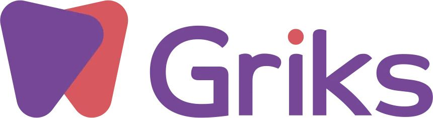
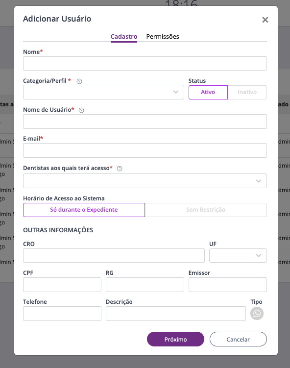
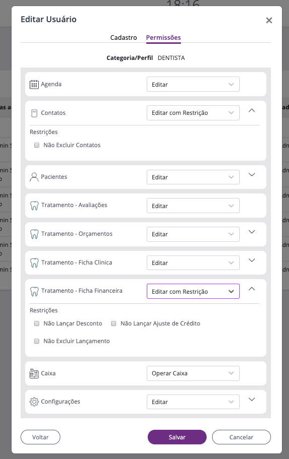

# Teste front-end developer

O objetivo deste é entender como o desenvolvedor pensa em uma aplicação, tendo um grande ecossistema de produtos onde é imprescindível que sua aplicação seja escalável, permitindo assim a inclusão de um novo produto ou provedor de serviços sem grandes dificuldades.

## Instruções:

* Organize o melhor possivel seus arquivos dentro do projeto;
* Ser fiel aos layouts disponibilizados;
* Os icones para serem utilizados na tela estão dentro da pasta icons
* O suporte crossbrowser a Chrome, Firefox e Safari;

## Consideramos como diferencial:
* Utilização de uma linguagem de preprocessador Sass;
* Desenvolva seu App utilizando algum framework MV* de mercado porem um diferencial seria a utilização de React;
* Utilização de bibliotecas CSS Bootstrap se optar por desenvolver utilizando React utilize Reactstrap;

## Entrega:
**Desejável que seja no Github Pages, utilizando as instruções abaixo...**
* Criar um repositório no GitHub, utilizando o Github Pages, mais detalhes em https://pages.github.com/;
* Enviar a URL navegável;
* A URL navegável deve ter o formato http://usuario.github.io/repositorio/;
* Pode ser enviado também como ".rar" no https://wetransfer.com/;

# Desafio:

Construa o modal abaixo, tente ser o mais fiel ao layout proposto.

## Muito Boa Sorte.

